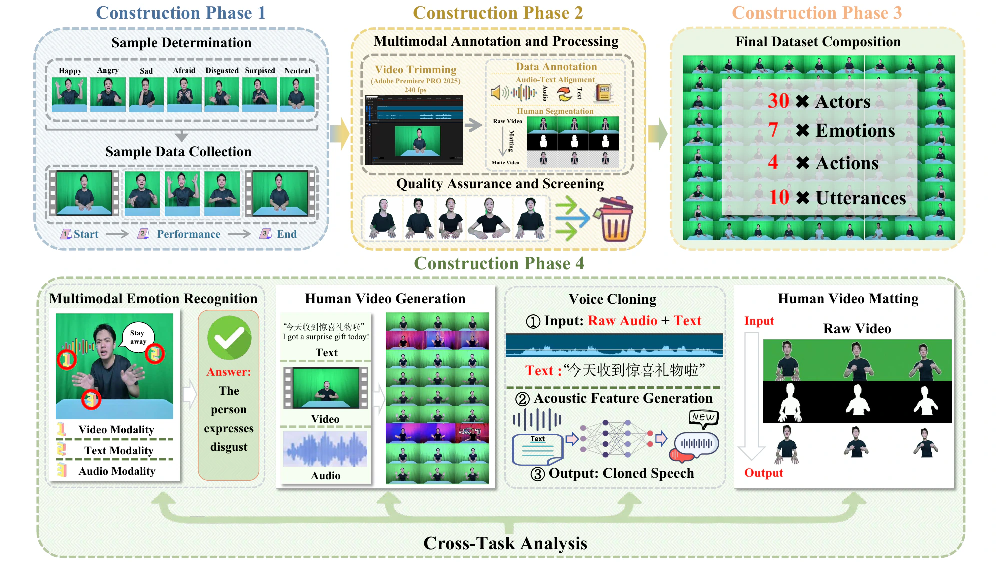
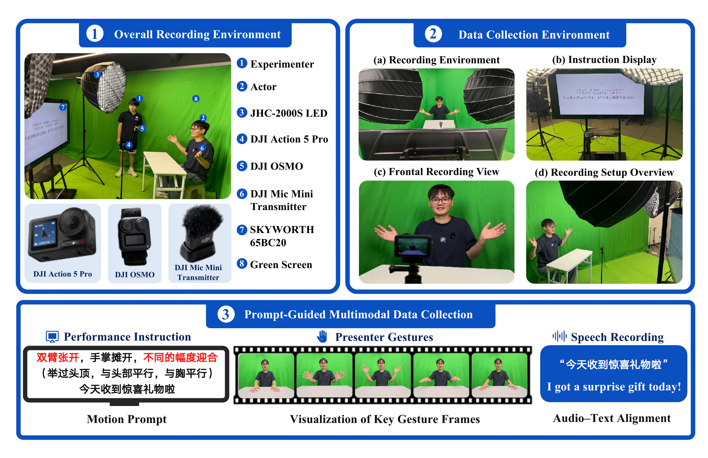
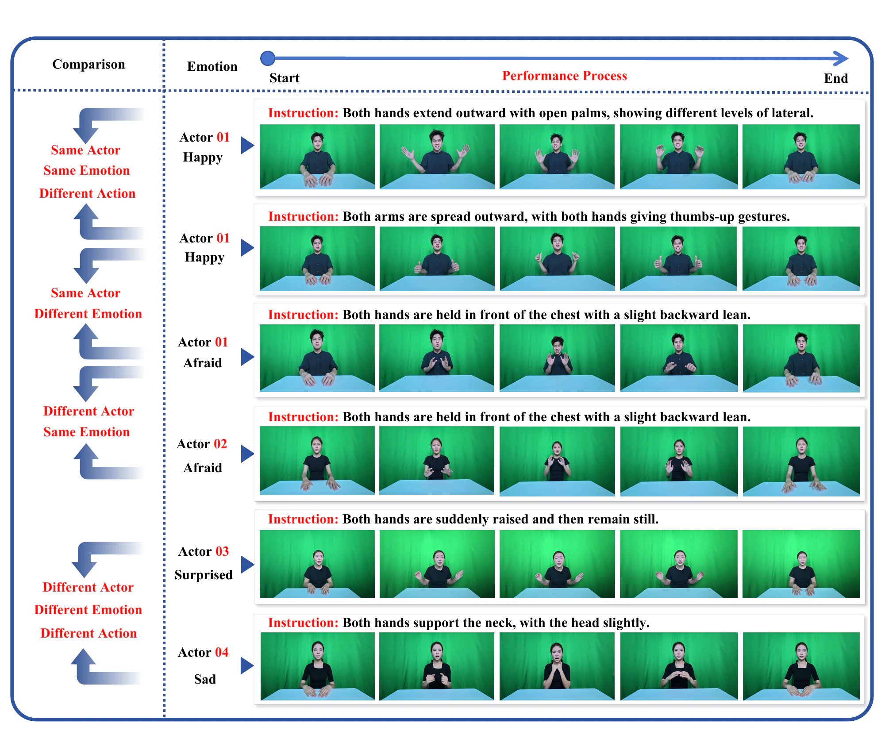
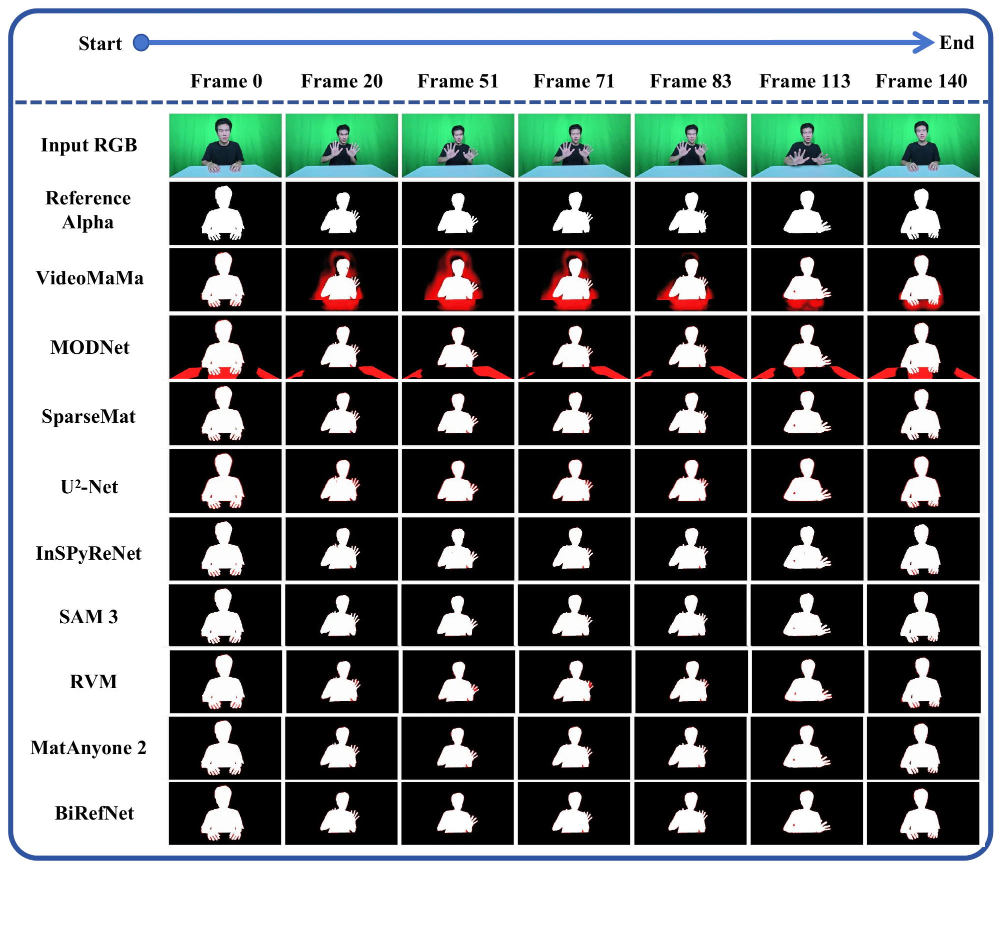
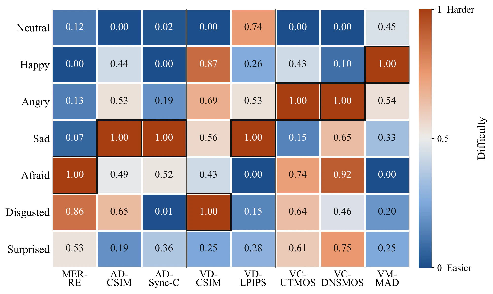

<div align="center">

# HUG-VIS

### A Multimodal Benchmark for Human-centered Understanding and Generation in Visual Intelligence

**Fei Ma · Zebang Cheng · Minghui Li · Hongbo Xu · Yuyong Tan · Yihua Shao · Hanling Wang · Zhou Liu · Yuqing Gao · Dong Wang · Long Ma · Laizhong Cui · Nicu Sebe · Qi Tian**

<sub>Guangdong Laboratory of Artificial Intelligence and Digital Economy (SZ) · Shenzhen University · Institute of Automation, Chinese Academy of Sciences · Pengcheng Laboratory · Tongji University · Tsinghua University · The Chinese University of Hong Kong · University of Trento · Huawei</sub>

<br><br>

[](https://hug-vis.github.io/#top)

[](https://huggingface.co/datasets/GML-MMGroup/HUG-VIS)
[](https://github.com/GML-MMGroup/HUG-VIS)

**TL;DR:** HUG-VIS evaluates multimodal emotion recognition, human video generation, voice cloning, and human video matting on the same condition-aligned grid of 8,400 controlled human performances.



</div>

## Overview

Human-centered visual intelligence is inherently multimodal: facial expression, body motion, vocal prosody, and linguistic content jointly convey what a person expresses and how that expression is performed. Existing emotion, generation, speech, and matting benchmarks are usually built from different subjects, acquisition conditions, and annotations, making it difficult to compare capabilities or analyze their relationships.

HUG-VIS provides a shared, condition-aligned foundation for both understanding and generation. Thirty professional actors each complete the same 280 emotion-action-prompt assignments under a controlled Mandarin studio protocol. Every performance is packaged with synchronized RGB video, noise-suppressed audio, an assigned prompt, a verified transcript, and an alpha-matte sequence.

The benchmark covers four tasks under a common zero-shot protocol:

- **Multimodal Emotion Recognition** from image, video, audio, text, and multimodal inputs.
- **Human Video Generation** under audio-driven and vision-driven settings.
- **Voice Cloning** with speech quality, speaker preservation, and perceptual evaluation.
- **Human Video Matting** with spatial and temporal alpha-matte evaluation.

## Dataset at a Glance

<div align="center">

**30 actors × 7 emotions × 4 actions × 10 utterances = 8,400 clips**

</div>

| Property | Value |
|---|---|
| Actors | 30 professional actors; gender-balanced; mean age approximately 20 years |
| Language | Mandarin Chinese |
| Emotion conditions | Happy, Angry, Sad, Afraid, Disgusted, Surprised, and Neutral |
| Action templates | 4 per emotion |
| Scenario-based utterances | 10 per action; 40 per emotion; 280 per actor |
| Performance clips | 8,400 total; 1,200 per emotion |
| Framing | Controlled, seated half-body capture |
| Video | 1920 × 1080; captured at 240 FPS and released at 30 FPS |
| Audio | Synchronized with video and noise-suppressed |
| Text | Assigned Mandarin prompt and verified transcript |
| Foreground supervision | Alpha-matte sequence |

Each actor performs an identical assignment inventory. This complete actor-by-assignment grid keeps the source material aligned across people and conditions, allowing downstream differences to be attributed more precisely to the actor, model, task, or evaluation criterion.

## Data Collection and Quality Assurance



### Acquisition setup

| Item | Specification |
|---|---|
| RGB camera | DJI Action 5 Pro with a fixed frontal mount |
| Background | Uniform green screen for chroma-key matting |
| Lighting | JHC-2000S LED with fixed color temperature and intensity |
| Framing | Seated half-body with a constant subject-camera distance |
| Microphone | DJI Mic Mini transmitter |
| Recording protocol | Rest → prompted performance → return to rest |

The actor begins at rest, delivers the assigned Mandarin prompt together with the corresponding emotion-consistent action, and returns to the resting pose. The shared temporal structure provides consistent boundaries for processing and evaluation while preserving natural variation across actors and performances.

### Processing and quality control

Alpha mattes are produced in Adobe Premiere Pro through chroma-key initialization followed by sequence-level refinement. Refinement focuses on hair, fingers, clothing, self-occlusion, and motion-blurred regions. RGB, audio, text, and alpha assets are then converted to consistent conventions.

Eight professional volunteers review the retained clips for:

- alignment among RGB video, audio, text, and alpha mattes;
- audio-visual synchronization;
- prompt and transcript accuracy; and
- segmentation errors caused by motion blur or self-occlusion.

Clips that fail these checks are discarded or returned for reprocessing.



## Benchmark

All tasks follow a common **zero-shot evaluation protocol**: no HUG-VIS benchmark sample is used for training, fine-tuning, calibration, or model selection. We report task-specific objective metrics and, for human video generation and voice cloning, complementary 1-5 mean opinion scores (MOS).

### Multimodal Emotion Recognition

We evaluate seven-class emotion recognition from image frames, video, audio, text, and their combinations. The table reports the best-performing model in each input setting.

| Input | Best model | Accuracy (%) ↑ |
|---|---|---:|
| Image frame | MMA-DFER | 37.05 |
| Video | MiniCPM-o 4.5 | 48.52 |
| Audio | Audio-Reasoner-7B | 74.38 |
| Text | DeepSeek-V3.2 | 82.93 |
| Video + Audio | Qwen2.5-Omni-7B | 73.70 |
| Video + Text | Qwen2.5-Omni-7B | 83.74 |
| Video + Audio + Text | Qwen2.5-Omni-7B | **83.79** |

Purely visual affect recognition remains the most difficult setting. The strongest image-frame and video systems reach 37.05% and 48.52%, compared with 74.38% for audio and 82.93% for text. For Qwen2.5-Omni-7B, adding text raises video-only accuracy from 27.77% to 83.74%, while adding audio to the video-text input increases it by only 0.05 percentage points. Current zero-shot systems therefore rely strongly on linguistic evidence and leave substantial room for better visual affect understanding and complementary multimodal fusion.

### Human Video Generation

HUG-VIS evaluates both **audio-driven** and **vision-driven** generation. Objective metrics and MOS are reported separately because the leading system depends on the evaluation criterion.

#### Audio-driven generation

| Evaluation | Criterion | Best model | Score |
|---|---|---|---:|
| Objective | CSIM ↑ | Ditto | **0.904** |
| Objective | Sync-C ↑ | LatentSync | **5.43** |
| Objective | Sync-D ↓ | Sonic / LatentSync | **7.73** |
| MOS | ID Similarity ↑ | Sonic | **4.44** |
| MOS | Emotion Naturalness ↑ | Sonic | **4.16** |
| MOS | Lip Synchronization ↑ | LatentSync | **4.47** |

The leaders separate across identity and synchronization. Ditto achieves the highest ArcFace identity similarity, while LatentSync leads Sync-C and shares the best Sync-D with Sonic. In the subjective study, Sonic receives the highest identity-similarity and emotion-naturalness scores, whereas LatentSync receives the highest lip-synchronization score.

#### Vision-driven generation

Vision-driven systems are compared **within their reported output scopes**: open-source Head Animation, open-source Body Animation, and closed-source systems. Scores should not be ranked directly across these groups.

| Group | Objective metric leaders | MOS leaders |
|---|---|---|
| Open-source · Head Animation | **X-NeMo:** LPIPS 0.520 ↓, PSNR 10.15 ↑, FID 150.57 ↓; **AniPortrait:** CSIM 0.884 ↑, SSIM 0.383 ↑ | **PersonaLive!:** ID 4.41 ↑; **X-NeMo:** Emotion 3.68 ↑, Motion 3.82 ↑ |
| Open-source · Body Animation | **Animate-X:** LPIPS 0.139 ↓, PSNR 18.81 ↑, SSIM 0.755 ↑; **Wan2.2:** CSIM 0.783 ↑, FID 20.24 ↓ | **Wan2.2:** ID 4.82 ↑, Emotion 4.61 ↑, Motion 4.72 ↑ |
| Closed-source | **Vidu:** LPIPS 0.195 ↓, CSIM 0.786 ↑, FID 20.05 ↓; **Kling:** PSNR 16.41 ↑, SSIM 0.721 ↑ | **Kling:** ID 4.76 ↑, Motion 4.64 ↑; **Vidu:** Emotion 4.60 ↑ |

No single system leads every criterion. For example, X-NeMo performs best on perceptual reconstruction, PSNR, and FID among open-source Head Animation methods, while AniPortrait leads identity similarity and SSIM. Within open-source Body Animation, Animate-X leads LPIPS, PSNR, and SSIM, whereas Wan2.2 leads CSIM and FID and receives the highest MOS on all three perceptual criteria.

### Voice Cloning

Voice cloning is evaluated with the reference-free quality predictors UTMOS and DNSMOS, Resemblyzer-based speaker similarity, and criterion-specific MOS. Real audio provides a speaker-similarity reference of 0.990; the reference-free quality predictors should not be interpreted as upper-bound fidelity scores.

| Group | UTMOS ↑ | DNSMOS ↑ | Speaker Sim. ↑ | MOS ID ↑ | MOS Emotion ↑ |
|---|---|---|---|---|---|
| Open-source | OpenAudio S1 · **2.32** | OpenAudio S1 · **3.01** | CosyVoice 3 · **0.856** | IndexTTS2 · **4.24** | IndexTTS2 · **4.40** |
| Closed-source | Inworld TTS-1.5 · **2.69** | Inworld TTS-1.5 · **3.22** | Eleven Multilingual v2 · **0.779** | Eleven Multilingual v2 · **3.73** | Eleven Multilingual v2 · **4.23** |

The rankings vary by evaluation axis. OpenAudio S1 and Inworld TTS-1.5 lead their respective groups on the reference-free quality predictors, while CosyVoice 3 and Eleven Multilingual v2 lead speaker similarity. In the subjective study, IndexTTS2 leads both open-source MOS criteria, and Eleven Multilingual v2 leads both closed-source MOS criteria.

### Human Video Matting

We evaluate nine matting systems using four spatial errors - MAD, MSE, gradient, and connectivity - together with the temporal dtSSD error. Lower is better for every metric.

| Model | MAD ↓ | MSE ↓ | dtSSD ↓ | Grad ↓ | Conn ↓ |
|---|---:|---:|---:|---:|---:|
| **BiRefNet** | **2.30** | **0.82** | **2.04** | **10.43** | **4.31** |
| MatAnyone 2 | 3.86 | 0.91 | 2.12 | 11.45 | 4.53 |

BiRefNet ranks first on all five criteria, while MatAnyone 2 ranks second throughout. The remaining errors concentrate around fine hand boundaries, rapidly changing motion contours, and foreground leakage, making boundary fidelity under motion the principal challenge for human video matting on HUG-VIS.



### Cross-task Insights

To compare heterogeneous tasks, HUG-VIS converts selected measurements into higher-is-harder difficulty profiles and normalizes each independently across the seven emotions. These profiles represent relative difficulty within each metric, not directly comparable raw scores across tasks.

| Capability metric | Hardest emotion |
|---|---|
| MER-RE · recognition error | Afraid |
| AD-CSIM · audio-driven identity | Sad |
| AD-Sync-C · audio-driven synchronization | Sad |
| VD-CSIM · vision-driven identity | Disgusted |
| VD-LPIPS · vision-driven reconstruction | Sad |
| VC-UTMOS · voice quality | Angry |
| VC-DNSMOS · voice quality | Angry |
| VM-MAD · matting error | Happy |



The shared actor-source-condition design also reveals several cross-task relationships:

| Analysis | Result | Interpretation |
|---|---:|---|
| VC-UTMOS vs. VC-DNSMOS emotion-difficulty profiles | ρ = **0.82** | The two reference-free voice-quality predictors produce strongly aligned emotion rankings. |
| MER-RE vs. VM-MAD emotion-difficulty profiles | ρ = **-0.86** | Recognition and matting exhibit opposing emotion-difficulty rankings. |
| Audio-driven vs. vision-driven source-level difficulty | ρ = **0.99** | The two generation regimes assign nearly identical relative difficulty to matched source clips. |
| Reference-alpha motion difficulty vs. dtSSD | ρ = **0.63** | Larger foreground changes are associated with higher temporal matting error. |

Neutral samples cluster at low motion difficulty and low temporal error, while Happy, Angry, and Disgusted involve larger alpha and foreground-centroid changes together with higher dtSSD. Overall, difficulty depends jointly on the instructed emotion, the evaluated capability, and the chosen criterion.

## Dataset Access

> **Controlled access.** HUG-VIS contains identifiable recordings of human participants and is available only to approved applicants for non-commercial academic research under the [HUG-VIS Dataset Academic Use License](HUG-VIS_Dataset_Academic_Use_License.docx). Once the gated release opens, access requests will be reviewed manually and, if approved, granted to an individual Hugging Face account. Completing the steps below does not guarantee approval.

### Request access

1. **Read the license.** Confirm that the proposed work and your institution satisfy the non-commercial academic-use terms.
2. **Submit the Hugging Face request.** Sign in to your individual Hugging Face user account, open the [HUG-VIS Dataset page](https://huggingface.co/datasets/GML-MMGroup/HUG-VIS), and complete every field in the access form. Provide the exact Hugging Face username that should receive access.
3. **Complete and sign the agreement.** Download the [Academic Use License](HUG-VIS_Dataset_Academic_Use_License.docx), enter the same name, institution, position/title, and official institutional email used in the Hugging Face form, and sign it. The responsible applicant/signatory and the Hugging Face requester must be the same eligible individual. That person must be a faculty member, researcher, or research staff member employed by a university or public/non-profit research institution. Students may not sign as the responsible applicant.
4. **Email the signed agreement.** Send it from the official institutional email entered in both forms to **Zebang Cheng** (`zebang.cheng@gmail.com`) and cc **Fei Ma** (`mafei@gml.ac.cn`). Use the subject `[HUG-VIS Access] Full Name | Institution | HF username`. [Email the signed agreement](mailto:zebang.cheng@gmail.com?cc=mafei@gml.ac.cn&subject=%5BHUG-VIS%20Access%5D%20Full%20Name%20%7C%20Institution%20%7C%20HF%20username).
5. **Wait for review.** The team matches the Hugging Face request to the signed agreement and institutional-email submission. If approved, access is granted only to the Hugging Face username named in the application. Do not share passwords, tokens, or access credentials.

> If the Dataset page does not display an access-request form, the gated release is not yet open. Please do not email incomplete materials.

### Download after approval

Authenticate with the same individual Hugging Face account that was approved:

```bash
hf auth login
hf download GML-MMGroup/HUG-VIS \
  --repo-type dataset \
  --local-dir HUG-VIS
```

## Responsible Use and License

The following summary does not replace the complete [HUG-VIS Dataset Academic Use License](HUG-VIS_Dataset_Academic_Use_License.docx).

- Use the Dataset and derived models or materials only for scientific, educational, and non-commercial academic purposes.
- Do not sell, transfer, sublicense, publish, upload, or otherwise redistribute the Dataset, annotations, restricted derivatives, or access credentials.
- Do not edit, manipulate, composite, dub, replace, or republish the original video or audio as modified source data. Technical processing required for research is permitted only within the approved research environment; processed copies and new annotations remain restricted.
- Research-group members may work with the Dataset only under the responsible applicant's direct supervision, in the approved research environment, and under the same terms. Never share Hugging Face credentials.
- Do not identify, re-identify, contact, track, impersonate, or harm recorded participants.
- Do not use HUG-VIS for surveillance, deceptive deepfakes, defamation, discrimination, sexual content, or unlawful purposes.
- Do not publicly release raw or identifiable samples, screenshots, audio clips, or outputs reproducing a participant's recognizable face or voice without prior written permission from the Data Provider.
- Store the Dataset securely, promptly report loss, leakage, or unauthorized access, and delete all copies when the research ends, access is withdrawn, or deletion is requested.

All actors provided written informed consent before recording for research capture and authorized use of their identifiable likeness, voice, and performed behavior. Public examples released by the project are limited to uses covered by those authorizations; this does not grant dataset recipients permission to republish identifiable material.

## Citation

The official BibTeX entry and arXiv link will be added when the paper record becomes available.

If you use HUG-VIS, please cite the official paper once the citation is released.

## Contact

For dataset access and project questions:

- **To:** [Zebang Cheng](mailto:zebang.cheng@gmail.com?cc=mafei%40gml.ac.cn) - `zebang.cheng@gmail.com`
- **Cc:** [Fei Ma](mailto:mafei@gml.ac.cn) - `mafei@gml.ac.cn`
- **Project page:** [https://hug-vis.github.io/#top](https://hug-vis.github.io/#top)
- **Dataset:** [https://huggingface.co/datasets/GML-MMGroup/HUG-VIS](https://huggingface.co/datasets/GML-MMGroup/HUG-VIS)
